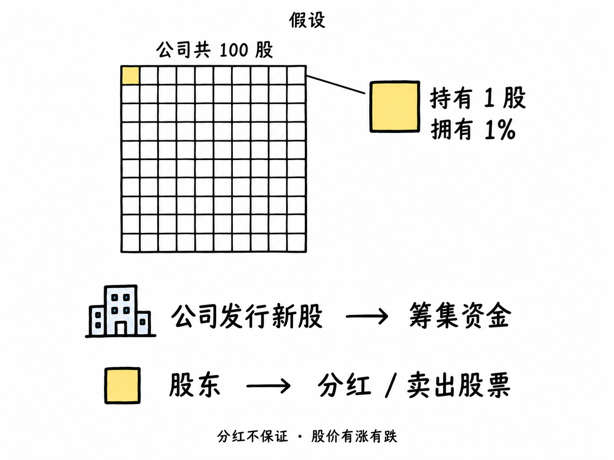

# 基础名词

先学会市场的语言。

## 股票

**股票代表公司的部分所有权，持有股票的人就是股东。** 假设公司共 100 股，你持有 1 股，就拥有 1% 的股份。

公司可以通过发行新股筹集资金；股东可以获得公司决定发放的分红，也可以卖出股票。**分红不保证，股价有涨有跌，投入的钱可能亏损。**

## 股价

解释待整理。

## 市值

解释待整理。

## 股本

解释待整理。

## 涨跌幅

解释待整理。

## 振幅

解释待整理。

## 换手率

解释待整理。

## 成交量

解释待整理。

## 成交额

解释待整理。

## 多头

解释待整理。

## 空头

解释待整理。

## 做多

解释待整理。

## 做空

解释待整理。
