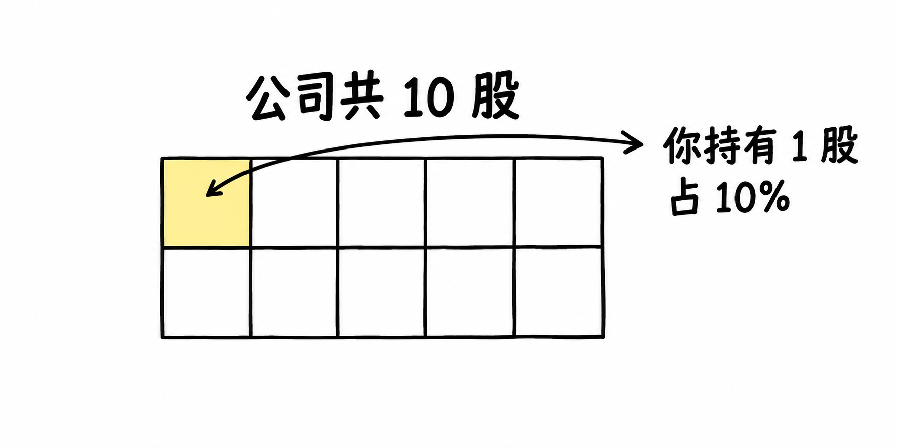

# 基础名词

先学会市场的语言。

## 股票

股票代表公司的部分所有权。假设公司共 10 股，你持有 1 股，就持有 10% 的股份。股价可能涨跌，分红也不保证。

## 股价

解释待整理。

## 市值

解释待整理。

## 股本

解释待整理。

## 涨跌幅

解释待整理。

## 振幅

解释待整理。

## 换手率

解释待整理。

## 成交量

解释待整理。

## 成交额

解释待整理。

## 多头

解释待整理。

## 空头

解释待整理。

## 做多

解释待整理。

## 做空

解释待整理。
