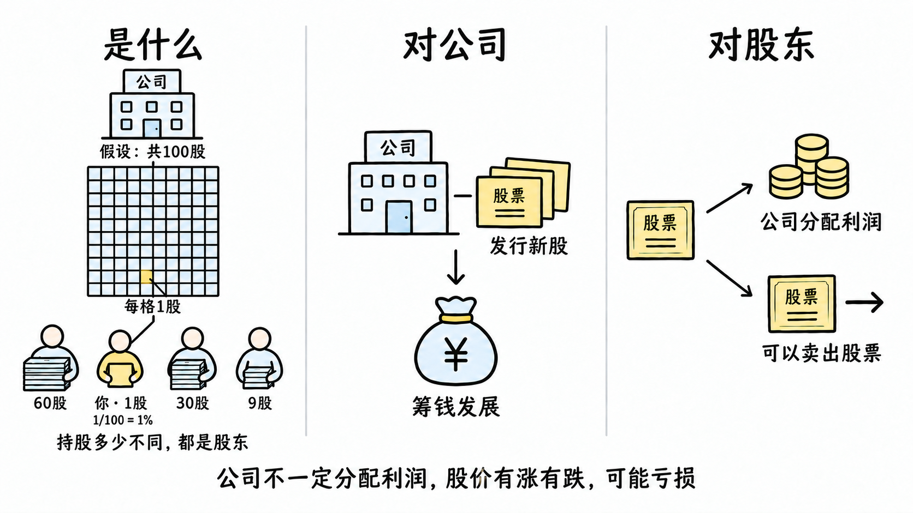

# 基础名词

先学会市场的语言。

## 股票

- **是什么**：股票代表公司的部分所有权，持有股票的人就是股东。假设公司共 100 股，你持有 1 股，即持有 **1/100（1%）**，也是股东之一。
- **对公司**：公司发行新股，可以筹钱发展。
- **对股东**：可以获得公司决定分配的利润，也可以卖出股票。**公司不一定分配利润，股价有涨有跌，投入的钱可能亏损**。

## 股价

解释待整理。

## 市值

解释待整理。

## 股本

解释待整理。

## 涨跌幅

解释待整理。

## 振幅

解释待整理。

## 换手率

解释待整理。

## 成交量

解释待整理。

## 成交额

解释待整理。

## 多头

解释待整理。

## 空头

解释待整理。

## 做多

解释待整理。

## 做空

解释待整理。
