# 基础名词

先学会市场的语言。以下以普通股票及常见 A 股日行情为例；数字均为教学假设，具体行情口径以软件说明为准。

## 股票

- **是什么**：股票代表公司的部分所有权，持有股票的人就是股东。假设公司共 100 股，你持有 1 股，即持有 **1/100（1%）**，也是股东之一。
- **对公司**：公司发行新股，买新股的人把钱交给公司，公司可以用这笔钱发展业务。
- **对股东**：公司决定分配利润时，股东可以获得分配的钱；卖出股票时，股东把股票交给买方，换回钱。**公司不一定分配利润，股价有涨有跌，投入的钱可能亏损**。

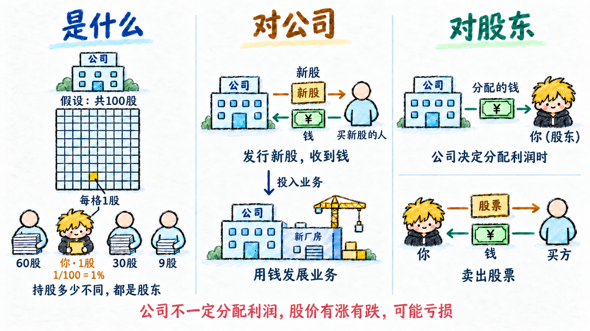

## 股价

- **每股多少钱**：股价是买卖一股股票的价格。假设股价为 10 元/股，买 100 股的股票金额就是 1,000 元，交易费用另算。
- **成交才算数**：交易中的“最新价”通常是最近一笔成交的价格。买卖申报按交易规则配对后才会成交，下一笔可能更高，也可能更低。显示买价、卖价，只代表有人申报买卖，不代表已经成交。

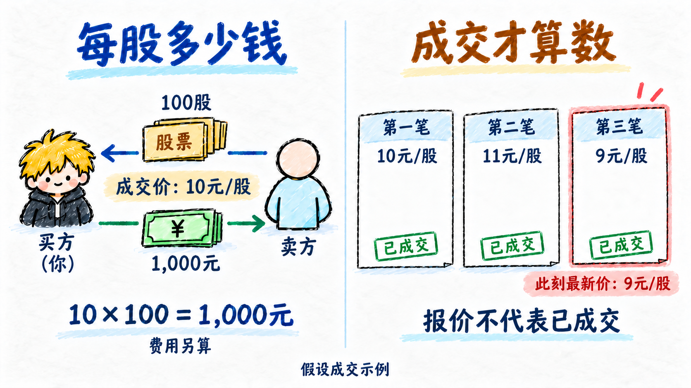

## 股本

- **数股份**：这里先按股票行情理解：“总股本”是公司已发行股份的总数量，单位为股，常用万股、亿股显示。总股本与可流通股数并不一定相同。
- **算份额**：假设公司共 10,000 股，你持有 100 股，持股比例就是 100 ÷ 10,000＝1%。股东之间买卖股票，改变归属，不改变总股本。
- **分清单位**：财报里的“股本”是按会计规则记录的资本金额，单位为元。它与行情中按“股”计的总股本不同，也不是股价乘股数。

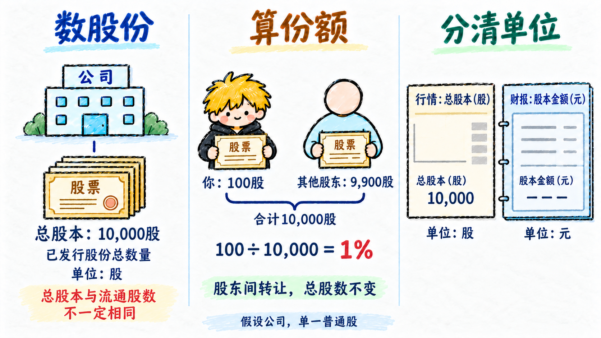

## 市值

- **按价格合算**：这里讲公司的总市值。假设公司只有一种普通股，总股本 100 股，股价 10 元/股，总市值就是 10 × 100＝1,000 元。
- **会随价格变**：总股本不变时，股价涨到 11 元，总市值变为 1,100 元；股价降到 9 元，就变为 900 元。
- **看规模有边界**：市值帮助比较公司股权在市场上的规模，但不等于公司账上的钱，也不保证公司真正值这么多；不能仅凭市值大小判断好坏。

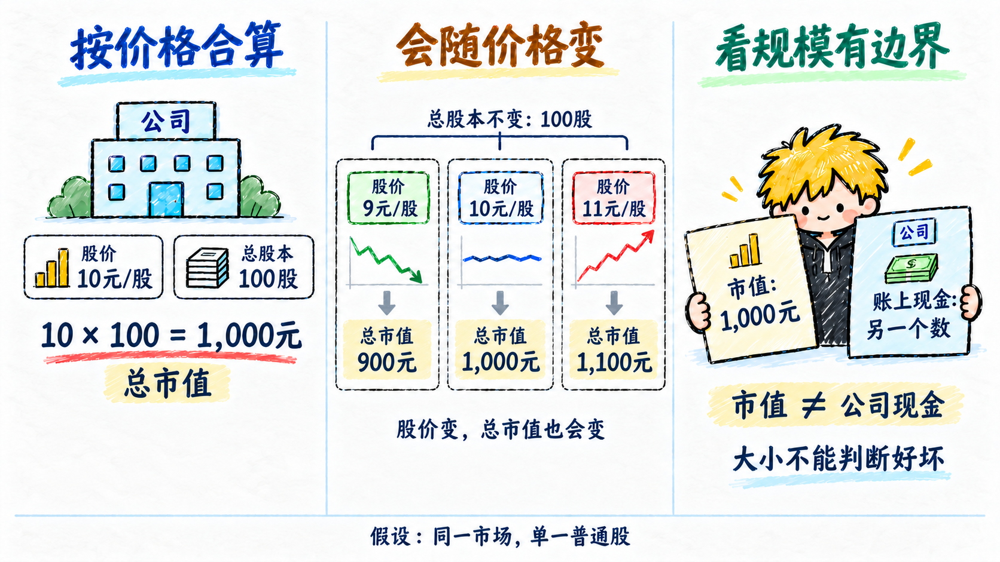

## 涨跌幅

- **先认基准**：涨跌幅表示价格相对基准上涨或下跌了百分之多少。常规股票日行情用昨收作基准，盘中看现价，收盘后看收盘价。
- **按比例算**：涨跌幅＝（现价－昨收）÷昨收×100%。假设昨收 10 元，现价 11 元就是 +10%，现价 9 元就是 −10%；同样变动 1 元，基准不同，比例也不同。
- **怎么看**：正数表示上涨，负数表示下跌，便于比较不同股价的相对变化。它不是你的持仓盈亏；个人盈亏还要看买入价和费用，特殊日须留意行情采用的基准。

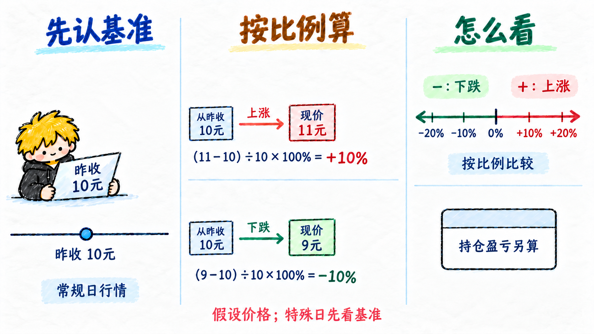

## 振幅

- **看高低距离**：振幅描述一段时间内价格波动有多大。这里采用常见股票日行情的昨收口径：日振幅＝（当天最高价－当天最低价）÷昨收×100%。
- **假设例子**：昨收 10 元，今天最高 11 元、最低 9 元，高低相差 2 元，日振幅就是 20%。盘中计算时，最高和最低指今天截至当前已成交的价格。
- **怎么看**：振幅帮助观察价格活动的范围，不能说明最后上涨还是下跌，也不是涨跌幅的累计。比较时要用相同时间和基准口径；软件采用其他基准时，先看说明。

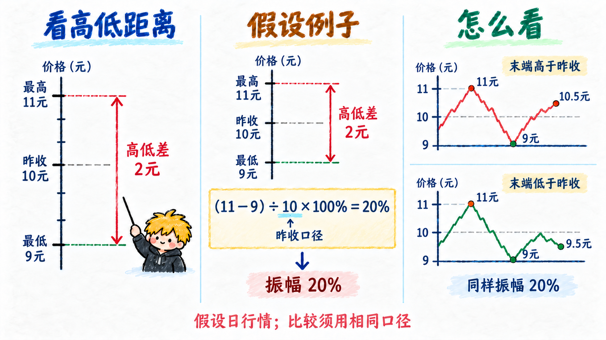

## 成交量

- **成交多少股**：成交量是一段时间内已完成交易的股数合计。买卖双方成交 100 股，只计 100 股，不把买入和卖出相加成 200 股。
- **先看单位**：A 股股票行情常用“股”或“手”，1 手＝100 股。假设当天只成交 100 股，成交量就是 100 股，也可显示为 1 手；这里说的是数量单位。
- **怎么看**：成交量帮助观察交易是否活跃。比较时要看相同的时间长度和统计范围；量大只表示成交多，不能单凭它判断之后涨跌，尚未成交的买卖委托也不计入。

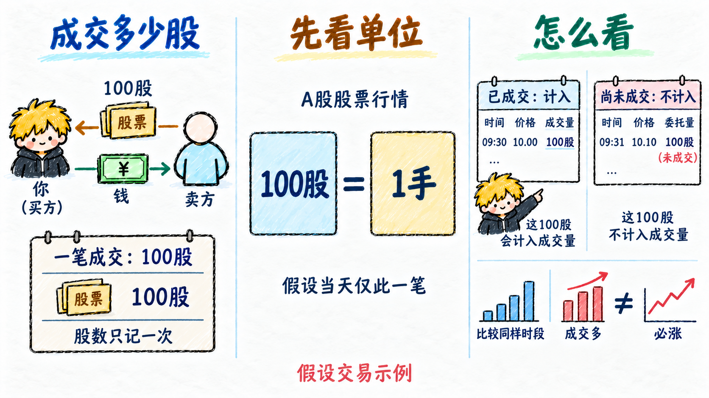

## 成交额

- **成交多少钱**：成交额是一段时间内已完成交易的金额合计。每笔先用成交价格乘成交股数，再把各笔金额相加，常用元、万元或亿元表示。
- **假设例子**：先以每股 10 元成交 100 股，再以每股 11 元成交 100 股，成交额＝10×100＋11×100＝2,100 元，不能用最后的 11 元乘总成交量 200 股。
- **怎么看**：成交额用钱描述成交规模。每笔交易都有买方付款、卖方收款，成交额本身不等于资金净流入，也不能单独推断之后的股价变化。

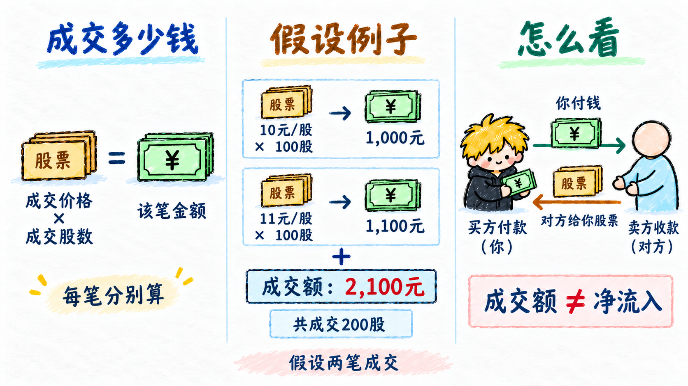

## 换手率

- **相对成交**：换手率把成交量和可流通的股票数量作比较。常用日换手率＝当日成交股数÷流通股本×100%，帮助观察相对于股份规模的成交活跃程度。
- **假设例子**：流通股本为 100 万股，今天成交 10 万股，按这个分母计算，换手率为 10%。它表示成交股数相当于流通股本的十分之一。
- **先看口径**：软件可能采用自由流通股本等不同分母，比较前先看说明。它统计成交股数，不统计股东人数；10%不表示10%的股东换了人，也不能单独判断之后涨跌。

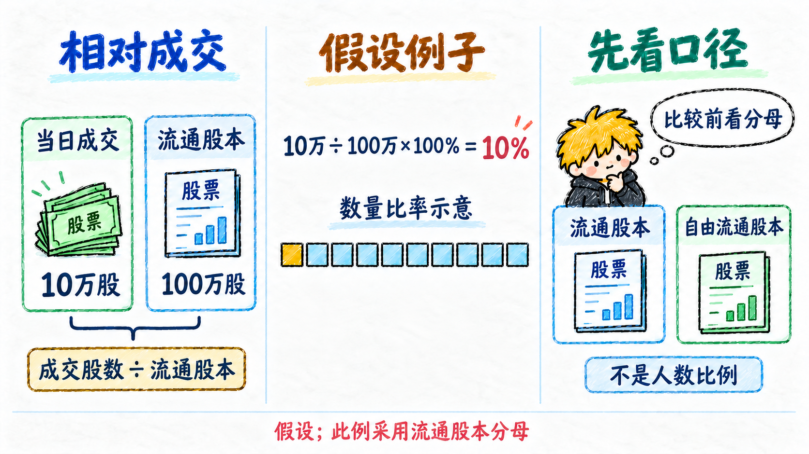

## 多头

- **看涨的一方**：谈行情时，多头常指认为某只股票或市场未来会上涨的人，描述的是看涨立场。
- **持仓的含义**：严格说，股票多头头寸是实际持有股票。股价上涨，所持股票的价值增加；股价下跌，价值减少。
- **判断不等于持仓**：你觉得某股会涨，但还没买入，只能说明看涨，不能据此认定你已有多头头寸。看涨也可能判断错误。

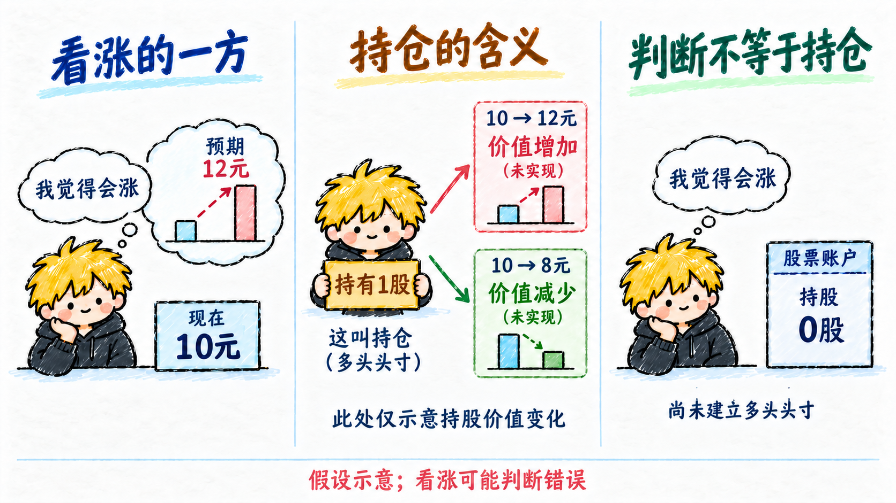

## 空头

- **看跌的一方**：谈行情时，空头常指认为某只股票或市场未来会下跌的人，描述的是看跌立场。
- **持仓的含义**：在借股做空的例子里，空头头寸是已借股卖出、尚未买回的状态。价格下跌，买回成本降低；上涨则增加。
- **看跌不等于做空**：不持股、只是认为会跌，并没有空头头寸；卖出自己原有的股票是在减少或结束持股，也不自动变成做空。

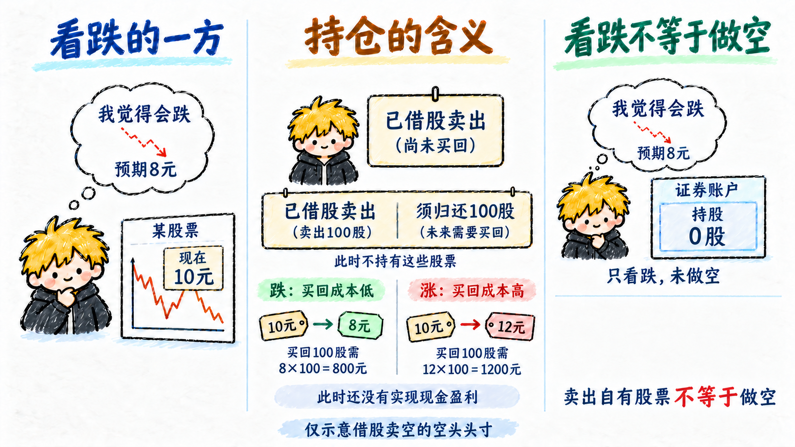

## 做多

- **买入持有**：在普通股票交易中，做多是买入股票、建立多头头寸，希望从上涨中获利；只说“会涨”还没有完成这个动作。
- **上涨获利，下跌亏损**：假设每股 10 元买入，12 元卖出，每股赚 2 元；若 8 元卖出，每股亏 2 元，均未计交易费用。
- **卖出结束**：卖出自己持有的股票是在减少或结束多头头寸。做多并不保证股价上涨，买入后也可能亏损。

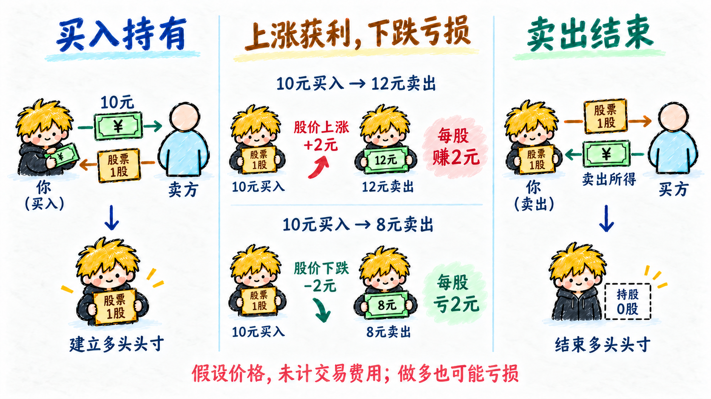

## 做空

- **借股**：这里用一种股票做空机制示意：借入股票，按约定归还同样数量。卖出自己原有的股票不属于借股做空。
- **卖出**：假设借入 100 股，以每股 10 元卖出，得到 1,000 元；此时仍须归还 100 股，并没有因为卖出就结束义务。
- **买回**：若每股 8 元买回 100 股，花 800 元，差额赚 200 元；若每股 12 元买回，花 1,200 元，差额亏 200 元，均未计费用。
- **归还**：把买回的 100 股归还出借方。买回前，价格上涨可能使亏损超过最初卖出所得；并非所有股票或账户都能做空。

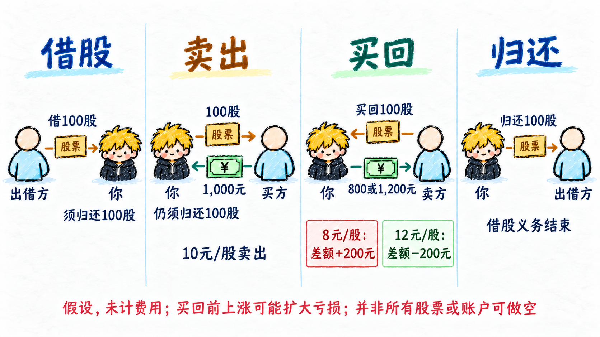
