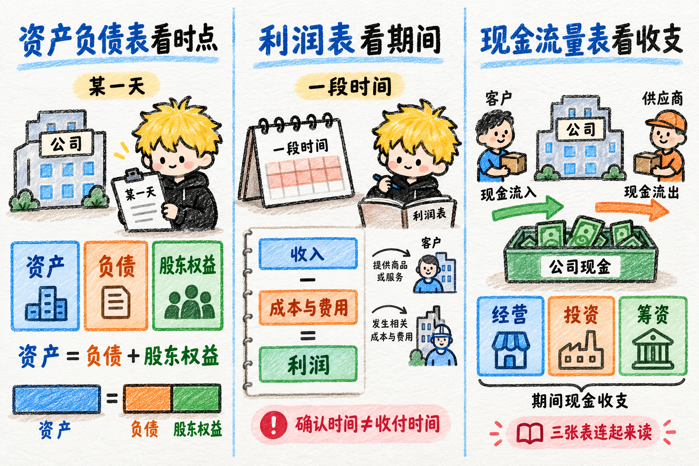
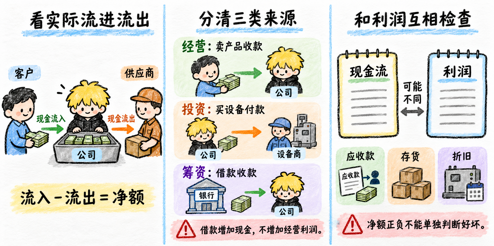
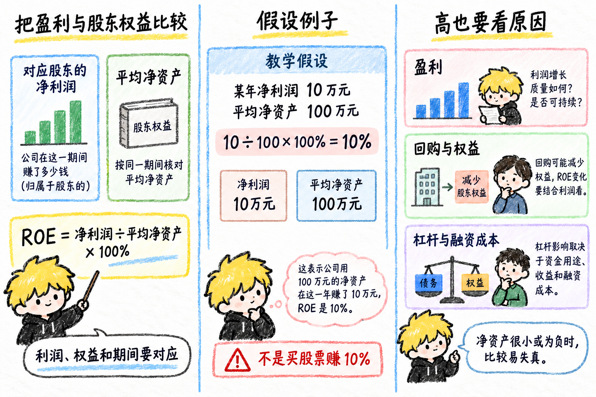
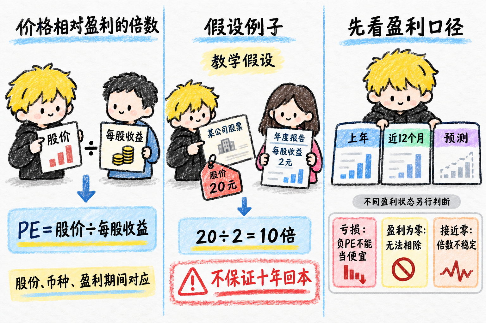
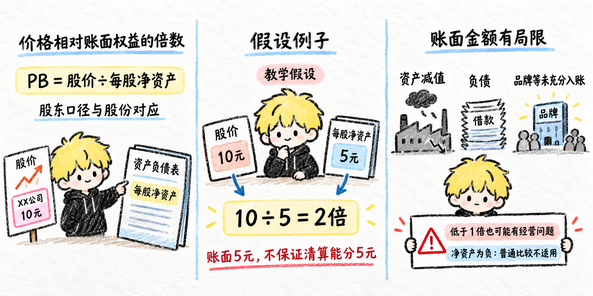
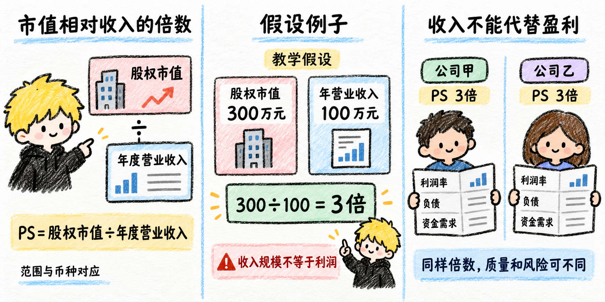
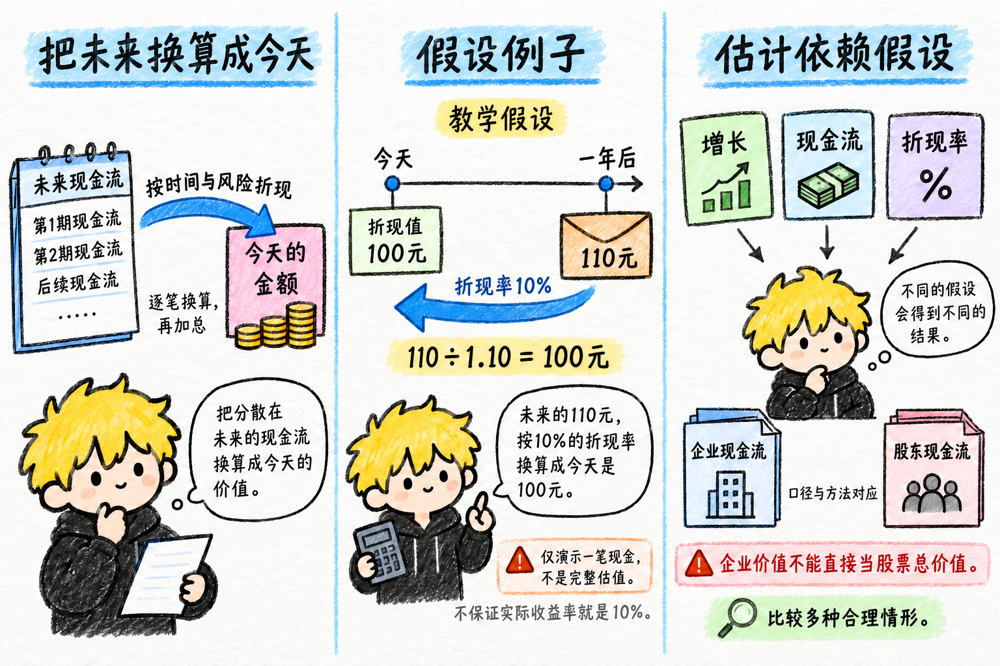

# 财务与估值

财务记录公司已经发生的经营与收支，估值尝试判断为它支付怎样的价格有依据。这是待逐点学习、确认的文字初稿；数字均为教学假设。报表期间、币种、合并范围和指标口径须先对齐，计算结果不能直接当成买卖结论。

## 三大财务报表

- **资产负债表看时点**：记录某一天的资产、负债与股东权益，满足“资产＝负债＋股东权益”。它帮助看公司拥有什么、欠什么，以及账面属于股东的部分。
- **利润表看期间**：记录一段时间的收入、成本、费用和利润，帮助看经营成果。它按会计规则确认金额，收入与费用发生的时间可能和现金收付不同。
- **现金流量表看收支**：记录期间经营、投资和筹资活动的现金流入流出，帮助看付款能力和钱的来源。三张表要连起来读，完整财报还有权益变动及附注等信息。

## 收入

- **经营取得的成果**：收入通常来自销售商品、提供服务等日常经营，按相应会计规则确认。它帮助观察业务规模，尚未扣除相关成本与费用。
- **假设例子**：商品已经交付并符合收入确认条件，售价 100 元，客户约定下月付款。当期可以确认 100 元收入，同时形成应收款，现金尚未到账。
- **先看来源与口径**：收入增加可能来自销量、价格或新增业务。借到的钱和股东投入的钱属于融资，不能算成销售收入；还要留意退货、回款和不同业务的收入确认方式。

## 利润

- **扣除相关支出后的成果**：利润是在相应收入中扣除成本、费用等项目后的会计结果。毛利润、营业利润、净利润扣除的范围不同，引用时应说明是哪一种。
- **假设例子**：收入 100 元，扣除全部相关成本、费用和税费 80 元后，净利润为 20 元。若部分收入尚未收款，盈利时也可能缺现金。
- **看利润从哪里来**：持续经营带来的利润、出售资产的收益和会计估计变化，需要分清。公司净利润与归属于母公司股东的净利润也可能不同，不能混着比较。

## 现金流

- **看实际流进流出**：现金流描述一定期间的现金及现金等价物收支。流入减流出得到净额，帮助检查公司能否支付日常支出、投资和偿债。
- **分清三类来源**：卖产品收款通常属于经营活动，买设备通常属于投资活动，借款或增发取得的钱属于筹资活动；借款让现金增加，却没有因此增加经营利润。
- **和利润互相检查**：应收款、存货变化和折旧等，会让现金流与利润不同。投资扩张可能造成现金流出，收缩投资也可能暂时改善现金；只看净额正负不能判断好坏。

## ROE（净资产收益率）

- **把盈利与股东权益比较**：ROE 常用净利润÷平均净资产×100%，观察账面股东权益对应的盈利能力。用哪部分股东的利润，就应配对应的权益，期间也要一致。
- **假设例子**：某年对应股东的净利润 10 万元，平均净资产 100 万元，ROE 为 10%。它描述公司盈利与账面权益的关系，不是股东买股票实际赚了 10%。
- **高也要看原因**：提高盈利或回购减少权益，可能抬高 ROE；增加杠杆也可能改变它，效果取决于资金用途、收益和融资成本。净资产很小或为负时，通常的高低比较容易失去意义。

## PE（市盈率）

- **价格相对盈利的倍数**：PE＝股价÷每股收益，帮助比较为每一元盈利支付多少价格。价格与收益须对应同类股份、币种和明确的盈利期间。
- **假设例子**：股价 20 元，一年的每股收益 2 元，PE 为 10 倍。它只是价格与该年盈利的比率，不能保证十年收回投入。
- **先看盈利口径**：上年盈利、最近十二个月盈利与预测盈利会得出不同结果。亏损时负 PE 不能按“越低越便宜”理解；盈利为零时无法相除，接近零时倍数也很不稳定。

## PB（市净率）

- **价格相对账面权益的倍数**：PB＝股价÷每股净资产，帮助比较市场价格与账面属于股东的权益。净资产采用哪部分股东的口径，要与股份对应。
- **假设例子**：股价 10 元，每股净资产 5 元，PB 为 2 倍。这里的 5 元是会计账面金额，不能据此保证卖掉公司资产后每股能分到 5 元。
- **账面金额有局限**：资产减值、负债和未充分体现在账面的品牌等都会影响解释。PB 低于 1 倍也可能伴随经营问题；净资产为负时，普通倍数比较不适用。

## PS（市销率）

- **市值相对收入的倍数**：PS 常用公司股权市值÷年度营业收入，观察市场为一定收入规模支付的股权价格。市值与收入要采用对应范围和相同币种。
- **假设例子**：股权市值 300 万元，年营业收入 100 万元，PS 为 3 倍。它比较收入规模，不计算公司实际留下多少利润。
- **收入不能代替盈利**：尚未盈利的公司也能计算 PS，但不同利润率、负债和资金需求会改变解释。同样 3 倍 PS 的两家公司，经营质量与股东风险可能相差很大。

## DCF（现金流折现）

- **把未来换算成今天**：DCF 先估计未来现金流，再用反映时间和风险的折现率换算成今天的金额并加总，帮助思考价值依赖哪些未来结果。
- **假设例子**：只有一年后收到的 110 元，折现率假设为 10%，今天的折现值为 110÷1.10＝100 元。这只演示一笔现金的折现，不是完整公司估值。
- **估计依赖假设**：增长、未来现金流和折现率稍变，结果可能明显变化。给整个企业的现金流与给股东的现金流须配对应方法，企业估值也不能直接当成股票总价值；应比较多种合理情形。

