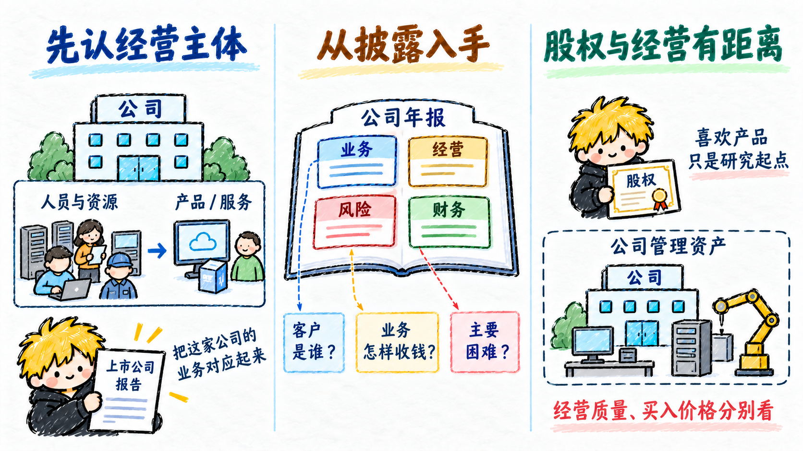
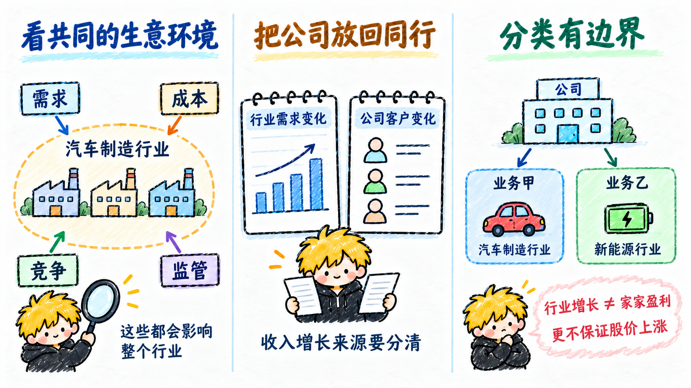
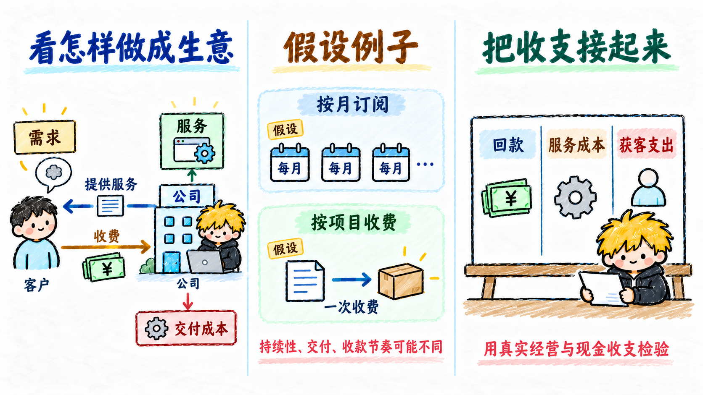
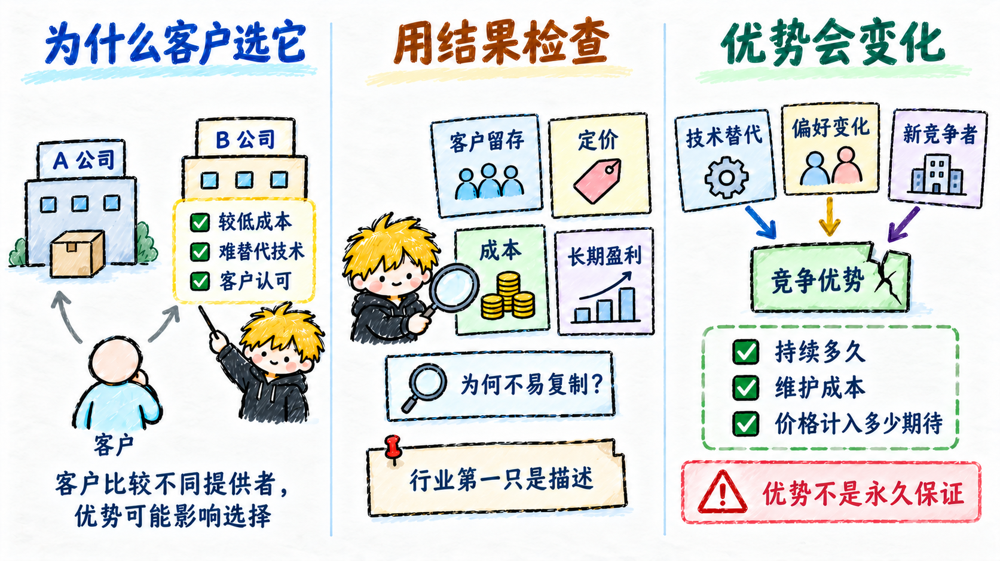
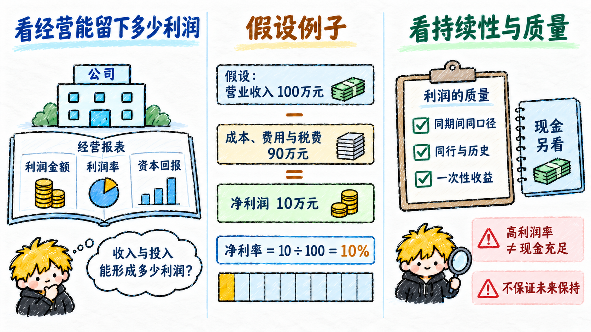
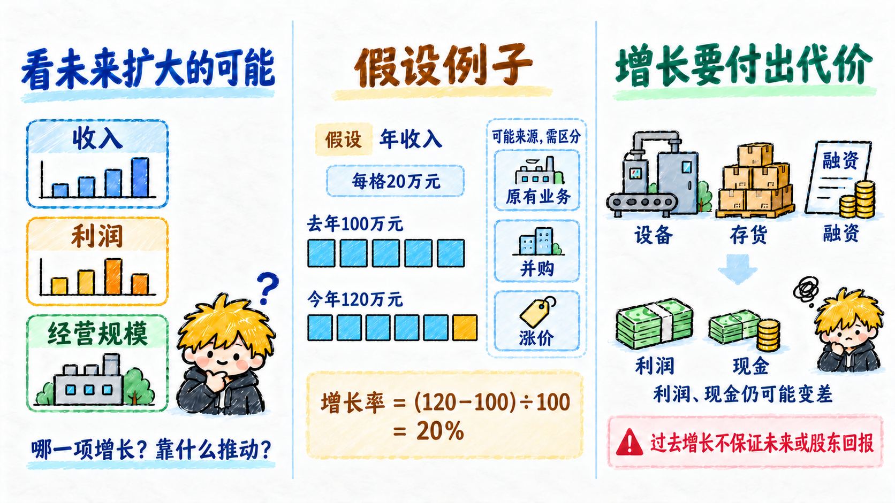

# 基本面

基本面研究关注公司怎样经营、能否持续创造价值，以及面临什么风险。这是待逐点学习、确认的文字初稿；所有数字均为教学假设，不能凭一个概念直接作出买卖判断。

## 公司

- **先认经营主体**：公司组织人员、资金和其他资源，提供产品或服务。研究一只股票，先认清它对应哪家上市公司、实际经营哪些业务。
- **从披露入手**：年报中的业务介绍、经营讨论、风险和财务数据，帮助了解客户是谁、钱从哪里来、主要困难是什么；多业务公司还要分开看各项业务。
- **股权与经营有距离**：股东持有公司股权，公司资产由公司依法管理。喜欢它的产品可以成为研究起点，经营质量和买入价格仍需分别判断。

## 行业

- **看共同的生意环境**：行业通常把提供相近产品或服务的企业放在一起，例如汽车制造。它帮助理解需求、成本、竞争和监管怎样影响公司。
- **把公司放回同行**：一家公司的收入增加，可能来自整个行业需求扩大，也可能来自抢到更多客户；比较同行，才能分清它自己的变化。
- **分类有边界**：同一公司可能横跨多个行业，不同细分业务的景气与利润也会不同。行业增长不能保证每家公司赚钱，更不能保证每只股票上涨。

## 商业模式

- **看怎样做成生意**：商业模式说明为谁解决什么问题、提供什么产品，以及怎样收费并承担成本，把创造价值和获得收入连起来。
- **假设例子**：一家软件公司按月收订阅费，另一家按项目一次收费。两者都卖软件，收入持续性、交付成本和收款节奏却可能不同。
- **把收支接起来**：有客户、有收入之后，还要看服务成本、获客支出与回款。模式听起来吸引人，仍须用真实经营和现金收支检验。

## 竞争优势

- **为什么客户选它**：竞争优势是相对同行更有利的条件，例如较低成本、难替代的技术，或客户认可的品牌；它可能帮助留住客户、维持盈利。
- **用结果检查**：看优势是否体现在客户留存、定价、成本或长期盈利中，并查明竞争者为什么不容易复制；“行业第一”只是一个描述。
- **优势会变化**：技术替代、客户偏好和新竞争者都可能削弱优势。优势存在多久、维护它要花多少钱，以及股价已经计入多少期待，都需要继续研究。

## 盈利能力

- **看经营能留下多少利润**：盈利能力描述公司把收入和投入转成利润的能力。利润总额、利润率和资本回报观察的角度不同，需要结合着看。
- **假设例子**：营业收入 100 万元、净利润 10 万元，净利率为 10÷100＝10%。收入规模相同，成本和费用不同，留下的利润也会不同。
- **看持续性与质量**：比较时采用相同期间和会计口径，结合同行与历史。一次出售资产可以增加当期利润；较高利润率也不能独自说明现金充足或未来还能保持。

## 成长性

- **看未来扩大的可能**：成长性关注公司的收入、利润或经营规模能否继续扩大，研究时要说明究竟是哪一项增长、靠什么推动。
- **假设例子**：年收入从 100 万元增至 120 万元，增长率为（120－100）÷100＝20%。还要区分原有业务增长、并购增加业务，以及涨价的影响。
- **增长要付出代价**：扩张可能需要新设备、更多存货和融资。收入增长时，利润或现金流仍可能变差；过去增长快也不能保证未来继续，更不能保证买入后的回报。

