# 筹码与资金

理解持股、成本与交易行为。个人账户成本、公司披露的股东持仓、行情软件估算的筹码，是不同层面的信息；以下数字均为教学假设。

## 筹码分布

- **看成本分布图**：这里的筹码指股票持仓。行情软件的筹码图通常用历史成交等数据估算不同价格附近的持仓成本，横条越长，表示该模型分配在该价位的筹码越多。
- **先分清数据性质**：它帮助观察估算成本集中在哪些区间，却不是每位股东真实成本的完整账本。历史成交分布也不等于当前持仓分布，软件模型和参数须分别核对。

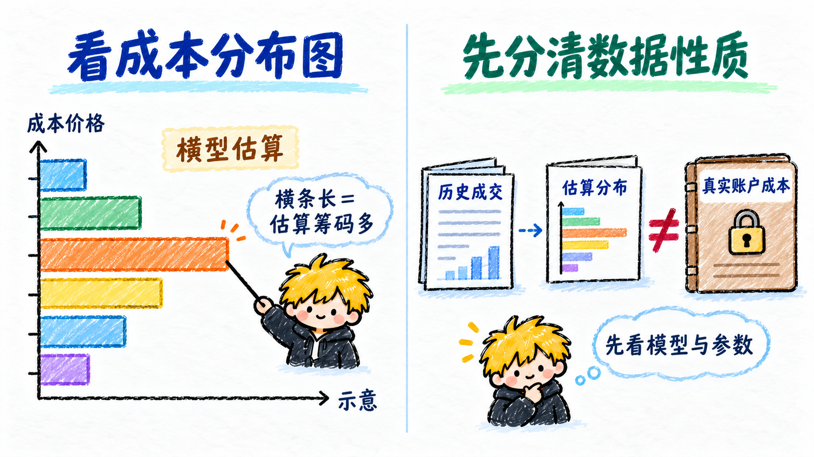

## 成本

- **看取得持股的代价**：个人持股成本与买入价格、数量和费用有关。假设分别以 10 元、12 元各买 100 股，未计费用的平均买入价为 11 元。
- **先认账户口径**：继续买卖、分配利润等可能改变账户显示的成本。软件估算的市场成本也不能替代自己的交易记录；成本不是价格必会回来的位置。

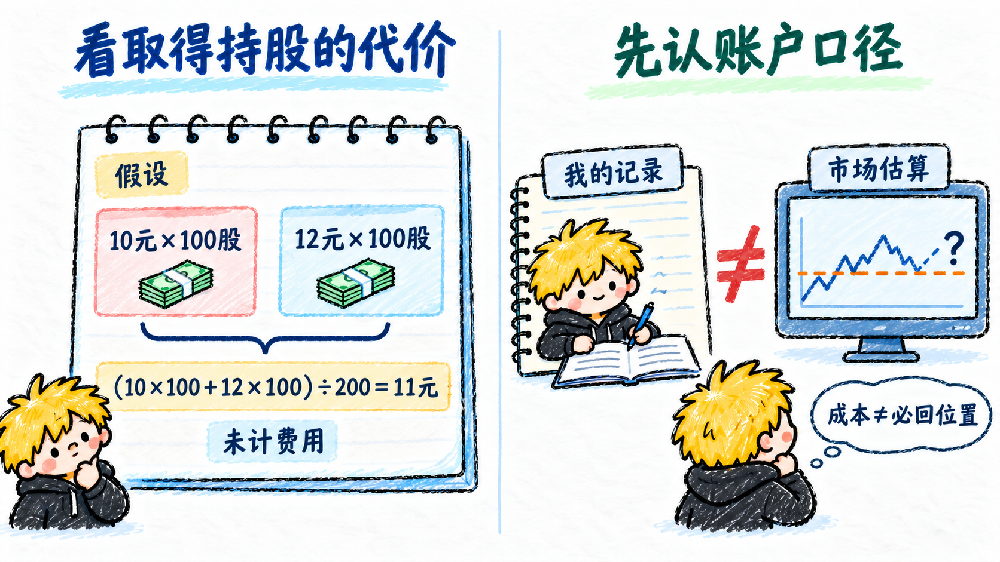

## 筹码峰

- **分布较集中的位置**：筹码图上较长的横条聚集，形成较突出的峰，表示模型估算有较多持仓成本落在这一带。
- **峰不代表某个人**：一个峰可能对应许多不同参与者，不能直接称为某个主力的成本。价格到这里是否受阻，还要看后续交易，不能由峰形自动决定。

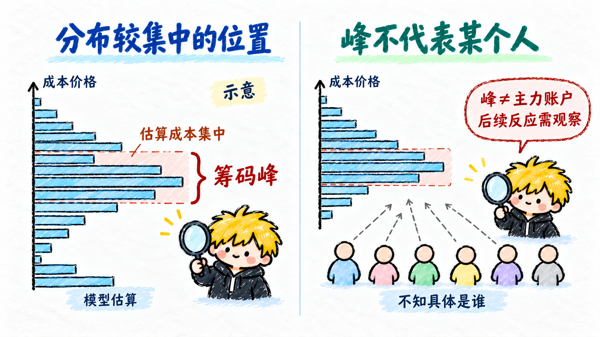

## 集中与分散

- **成本集中还是持有人集中**：筹码成本集中，指估算成本落在较窄价格区间；股权集中，指较多股份由较少持有人持有。两者不是同一件事。
- **分散也要说口径**：成本分布宽，不等于持有人一定多；股东人数少，也不表示他们成本相近。集中或分散都不能单独判断下一步涨跌。

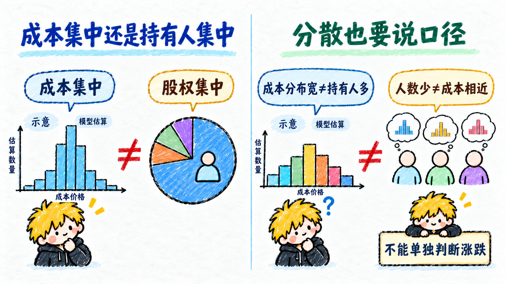

## 套牢盘

- **成本高于现价**：假设真实买入成本为 12 元、现价为 10 元，该持股处于浮亏。筹码软件则根据估算成本，将现价以上的部分归作套牢筹码。
- **估算不是实际人数**：图上“套牢比例”通常对应模型中的筹码数量比例，不是已核实的亏损股东人数。持有人什么时候卖，不能从这个比例直接得知。

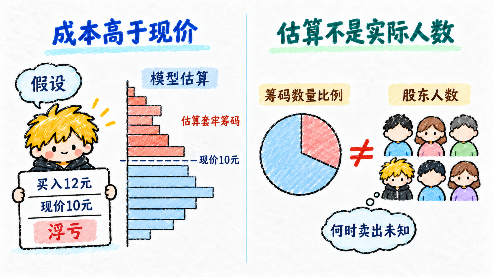

## 获利盘

- **成本低于现价**：假设真实买入成本为 8 元、现价为 10 元，该持股有账面利润。筹码软件通常把估算成本低于现价的部分归作获利筹码。
- **比例不等于卖出计划**：软件显示的获利比例依赖模型，未计费用时也不等于每个人实际净收益。获利持股可能兑现，也可能继续持有。

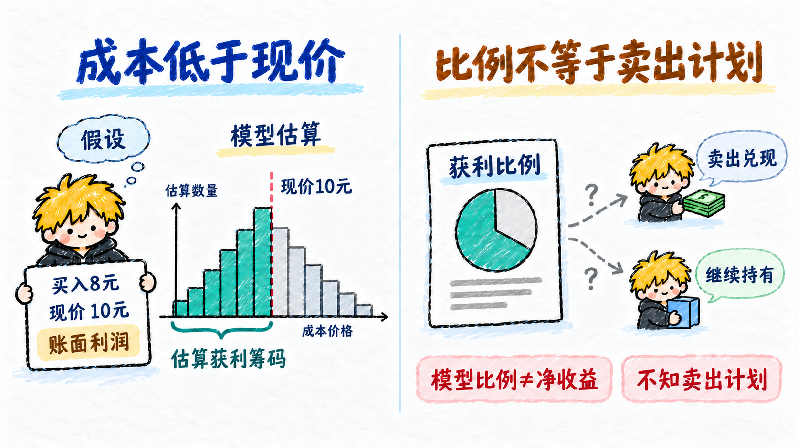

## 吸筹

- **逐步增加持股的说法**：吸筹通常用来描述某个参与者持续买入、积累持股的行为；买入行为本身不等于未来一定拉升。
- **意图需要证据**：仅凭横盘、放量或筹码峰，不能确定是谁在积累，也不能确认对方目的。账户记录或依法披露的持仓，与走势图猜测要分开。

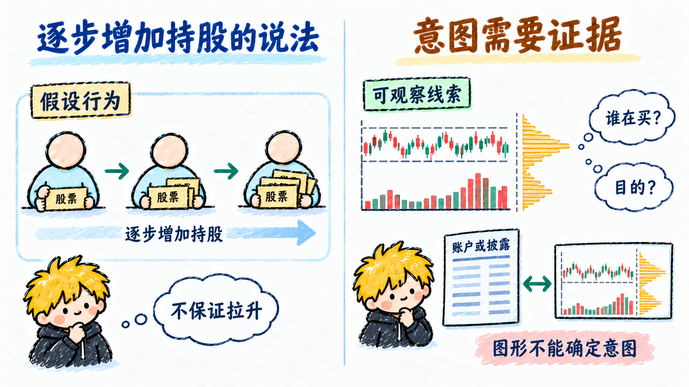

## 洗盘

- **一种意图解释**：洗盘通常指有人有意制造波动，试图让部分持股者卖出的说法。它把价格变化解释为某个参与者的计划。
- **下跌不能自动归因**：回落也可能来自信息变化、普通卖出或市场风险。缺少交易与行为证据时，“这是洗盘”只能是待验证解释，不能当作继续持有的保证。

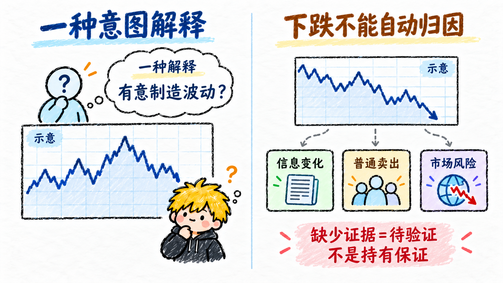

## 拉升

- **价格向上推进**：拉升常用来描述价格较明显地上涨；有时也被用来指某个参与者通过买入推动价格，需要分清描述与归因。
- **上涨不等于操盘证据**：正常信息和交易也会带来上涨。仅凭走势不能确定是谁推动，更不能认定后面一定继续涨；操纵市场需要独立证据认定。

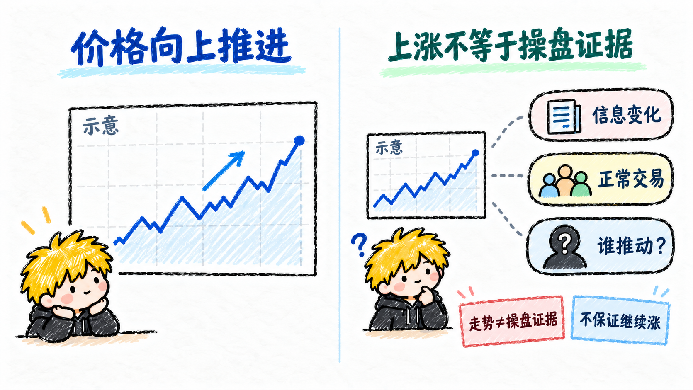

## 派发

- **逐步减少持股的说法**：派发通常描述持股较多的参与者逐步卖出、将股票转给其他买方的过程。卖出可以发生在上涨、横盘或下跌中。
- **放量不能证明谁在卖**：每笔成交都有买卖双方。仅凭放量或高位震荡，不能确认特定参与者正在退出，也不能把形态直接当作已证实的派发。

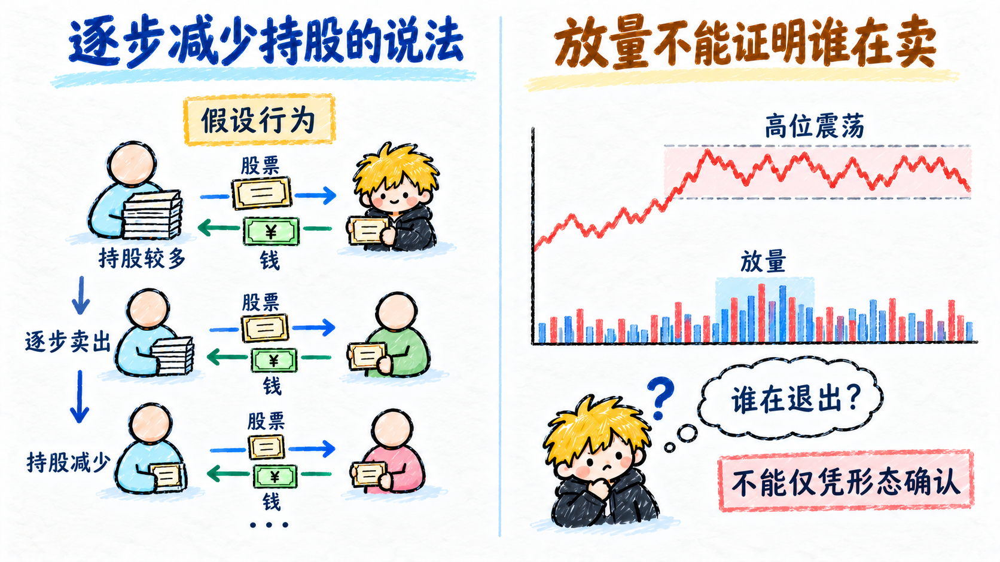

## 庄散博弈

- **能力和约束可能不同**：这个说法通常讨论较大持仓或资金参与者与普通个人投资者的互动。资金规模、交易成本、信息和期限可能不同，并不天然分成两个统一阵营。
- **先观察，再解释**：大单不一定属于同一机构，机构也会互相交易、判断失误。不能假设每次涨跌都有庄家统一安排；可观察的成交与推测的意图分别记录。

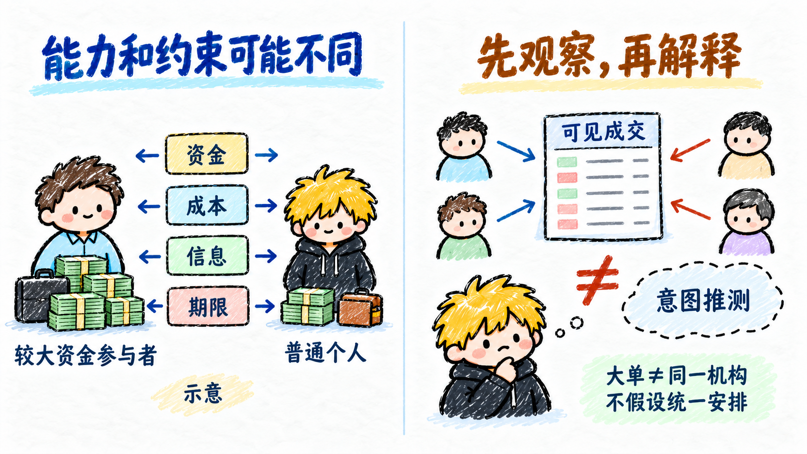
