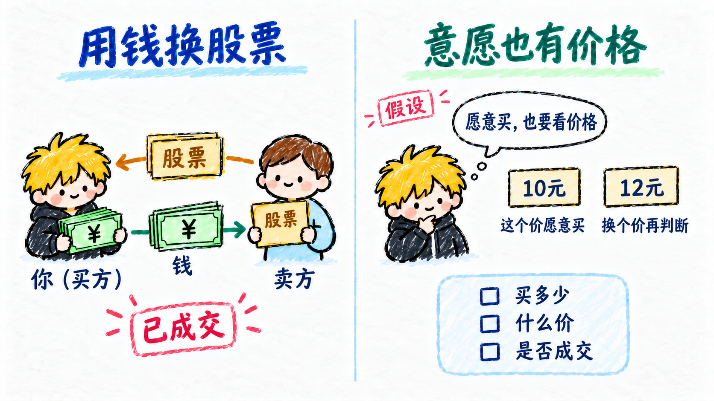
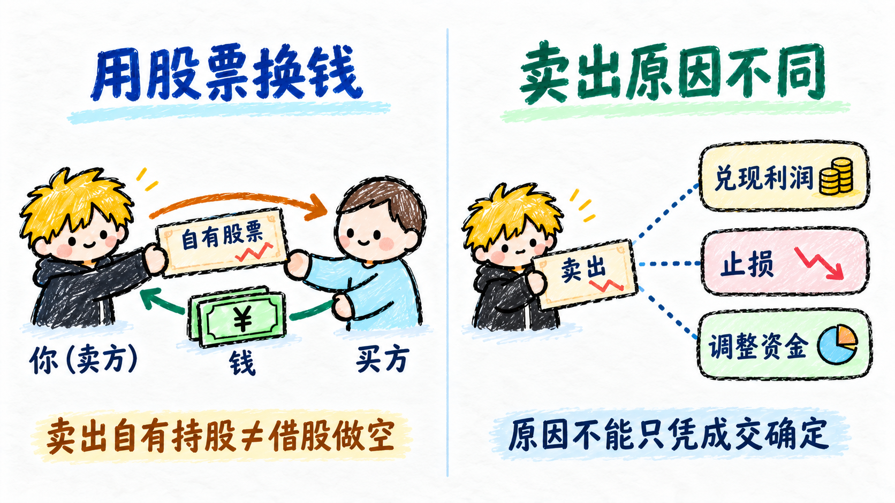
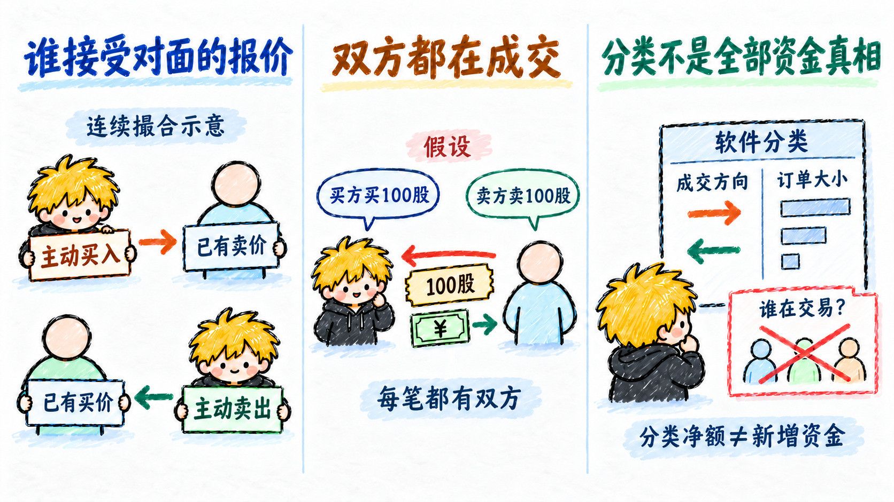
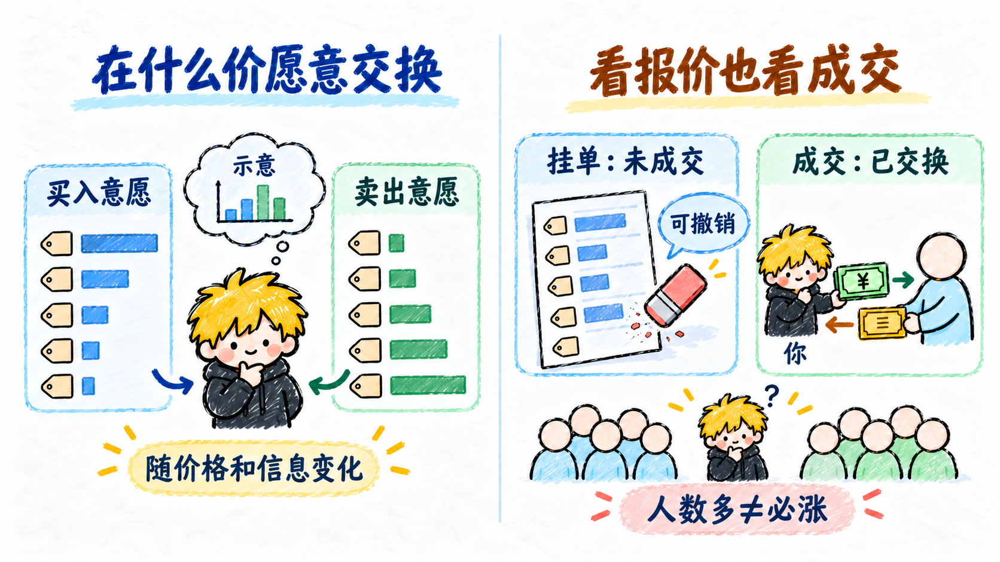
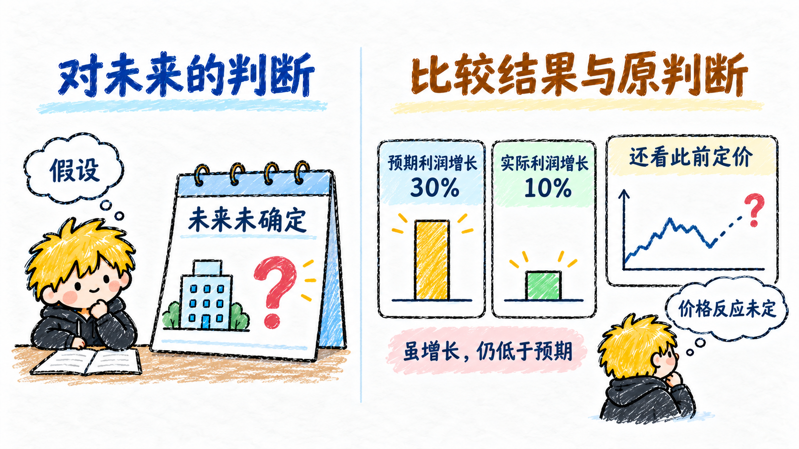
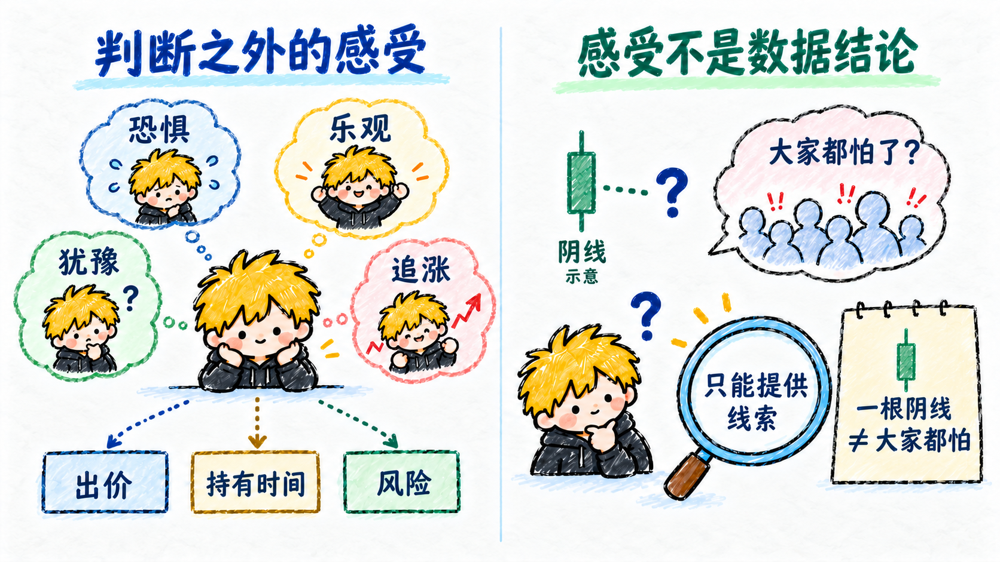
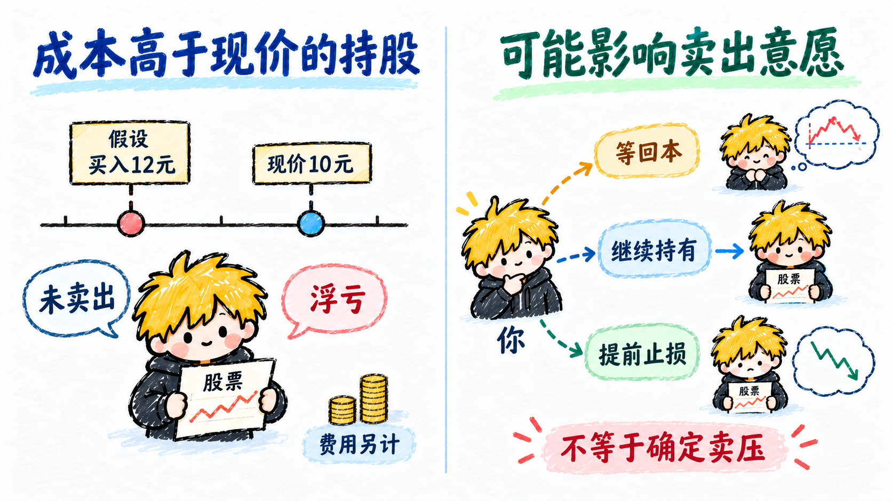
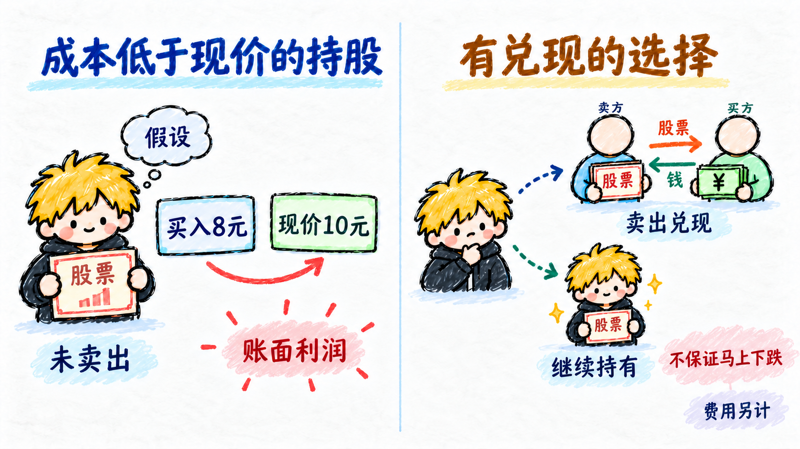
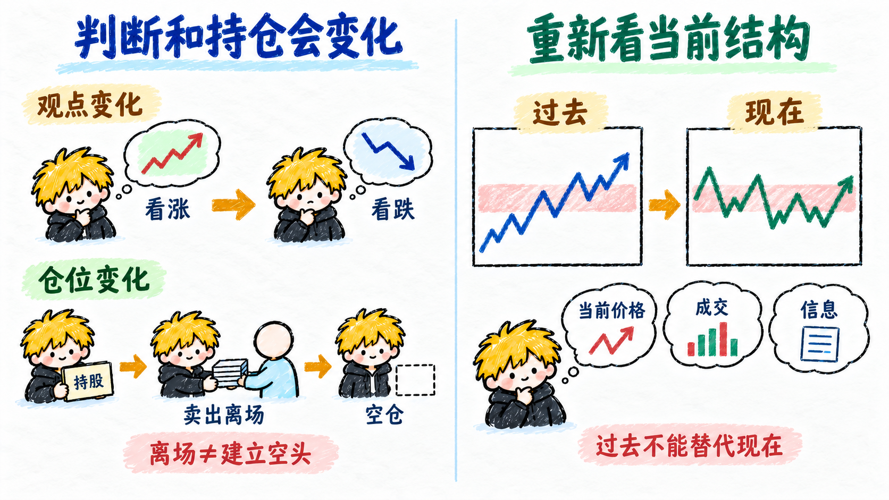

# 多空思维

从看价格，逐步转向理解参与者的交易与判断。成交数据能告诉我们发生了什么，却通常不能直接告诉我们每个人为什么这样做；以下数字均为教学假设。

## 买方

- **用钱换股票**：买方是在这笔交易中支付价款、取得股票的一方。同一个人这次买、下次卖，身份不是永久标签。
- **意愿也有价格**：有人愿意在 10 元买，不代表愿意在 12 元买。观察买方要同时看愿意买多少、出什么价，以及是否真正成交。

## 卖方

- **用股票换钱**：卖方是在这笔交易中交出股票、取得价款的一方。卖出自己原有的持股，不等于借股做空。
- **卖出原因不同**：有人兑现利润，有人止损，也有人调整资金安排。看到卖出，不能据此认定卖方一定看跌或知道内幕。

## 主动买卖

- **谁接受对面的报价**：以连续撮合交易为例，买单主动与已有卖单成交称主动买入；卖单主动与已有买单成交称主动卖出。具体判定依赖行情数据和软件口径。
- **双方都在成交**：假设一笔主动买入 100 股，仍有卖方卖出这 100 股。主动买卖描述成交发起方向，不是市场只有买入或只有卖出。
- **分类不是全部资金真相**：软件可能按成交方向、订单大小等统计流入流出。先读算法；某类净额不等于市场凭空多了相同金额的钱，也不能直接识别交易者身份。

## 供需

- **在什么价愿意交换**：股票交易中的供需，是不同价格下愿意买入和卖出的数量。它会随价格、信息和参与者判断变化，并非两个固定的总数。
- **看报价也看成交**：挂单描述尚未完成的意愿，成交描述已经完成的交换。挂单可能撤销；买卖各有一方，不能只用人数多少判断价格方向。

## 预期

- **对未来的判断**：预期是参与者对公司经营、政策或价格等未来结果的看法。交易时，大家面对的是尚未确定的未来。
- **比较结果与原判断**：假设市场原本期待利润增长 30%，实际增长 10%，虽然利润增加，也可能低于原预期。价格怎么反应还取决于此前定价与其他因素，不能把利好机械等同于上涨。

## 情绪

- **判断之外的感受**：恐惧、乐观、犹豫和急于追涨，都可能影响愿意出的价格、持有多久及承担多少风险。
- **感受不是数据结论**：情绪难以直接测量，涨跌和热度只能提供线索。“大家都怕了”不能仅凭一根阴线确认，也不自动意味着可以买。

## 套牢盘

- **成本高于现价的持股**：假设以 12 元买入、现在是 10 元，未卖出的这部分持股处于浮亏，通常称套牢盘；实际盈亏还要算费用。
- **可能影响卖出意愿**：有人等回到成本再卖，有人继续持有或提前止损。因此成本附近可能值得观察，但不能把所有套牢持股都当作确定的卖压。

## 获利盘

- **成本低于现价的持股**：假设以 8 元买入、现在是 10 元，未卖出的持股已有账面利润，通常称获利盘；并不表示已经兑现。
- **有兑现的选择**：有人卖出锁定利润，有人继续持有。获利盘多不保证马上下跌，也不能直接知道谁会卖出。

## 多空转换

- **判断和持仓会变化**：原本看涨的人可能转为看跌；原本持股的人也可能卖出离场，结束持股不等于建立空头头寸。观点改变与仓位改变是两件事，不一定同时发生。
- **重新看当前结构**：同一个价格区域，参与者的意愿可能已与过去不同。过去上涨或下跌只是背景，不能替代对当前价格、成交和信息的检查。

