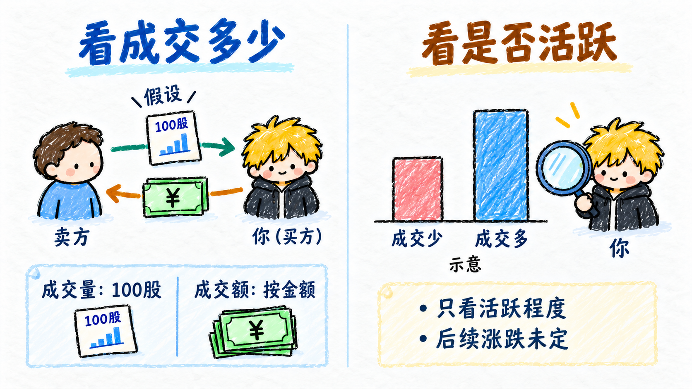
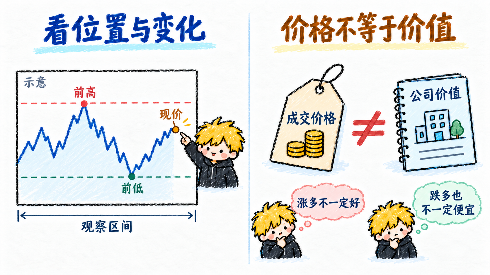
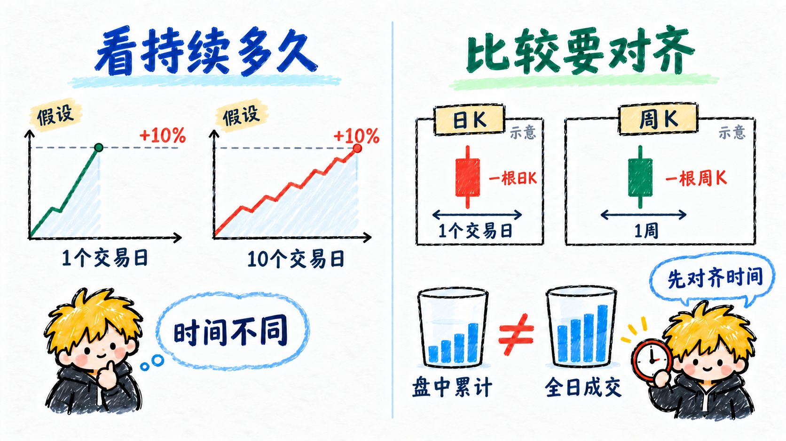
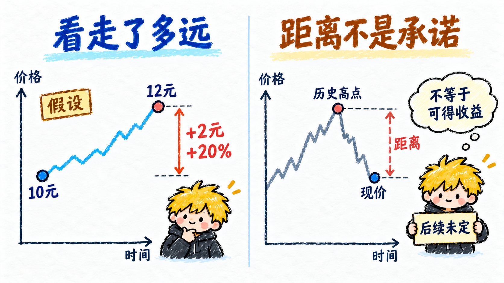
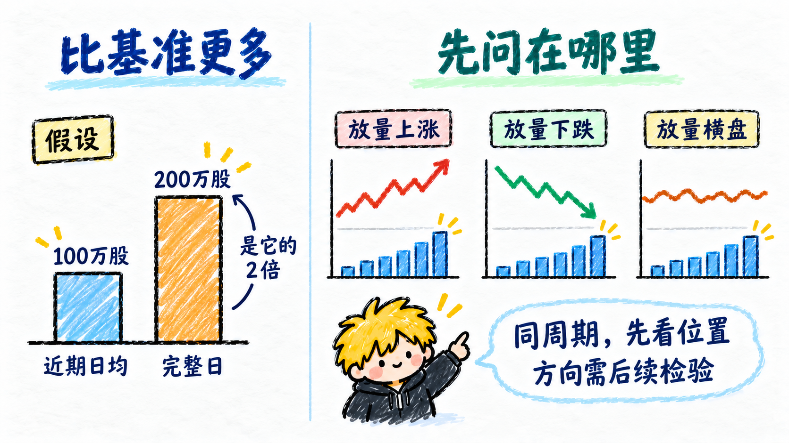
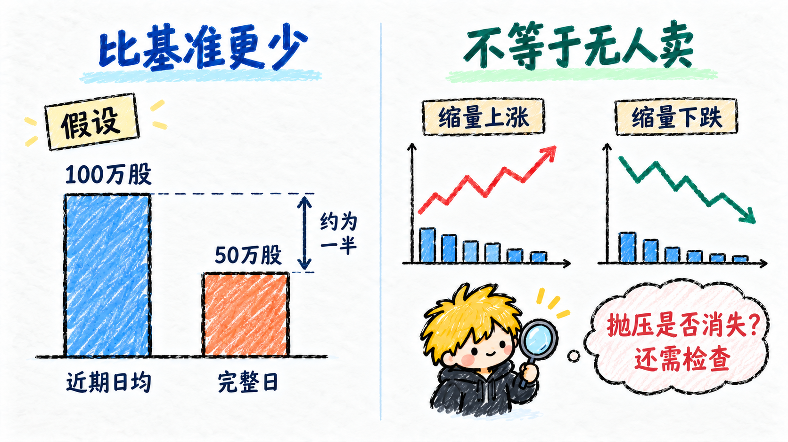
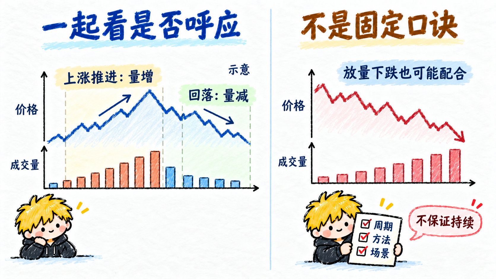
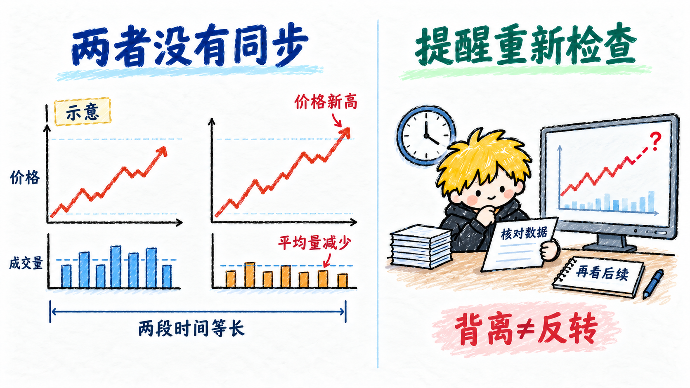

# 量价时空

理解价格运动时，把成交、价格、持续时间和运行距离放在一起看。以下以股票为例，数字均为教学假设；比较前先统一周期、单位和统计口径。

## 量

- **看成交多少**：这里的“量”主要指成交量，即一定时间内完成交易的股数；成交额则用钱表示规模。先认清图上显示的是股、手，还是金额。
- **看是否活跃**：量帮助比较交易活跃程度，但每笔成交都有买卖双方。量大不等于买方净增加了同样多的持仓，也不能直接说明之后涨跌。

## 价

- **看位置与变化**：价格告诉你股票在哪里成交、比此前高还是低。看现价之外，还要看它相对前高、前低和观察区间的位置。
- **价格不等于价值**：价格是交易结果，不是对公司价值的准确测量。涨得多不一定好，跌得多也不一定便宜。

## 时间

- **看持续多久**：同样上涨 10%，一天完成和十个交易日完成，速度与波动过程不同；这里的时间包括所看周期及走势持续长度。
- **比较要对齐**：一根日 K 线与一根周 K 线覆盖的时间不同。盘中累计成交也不能直接和完整一天的成交相比，不说明时间就容易误读。

## 空间

- **看走了多远**：这里的空间指价格运行的距离和幅度。假设股价从 10 元涨到 12 元，已经走了 2 元，即 20%。
- **距离不是承诺**：当前价格与某个历史高点之间的差距，可以帮助描述位置；不代表价格一定会回到那里，更不能把它直接当作可获得的收益。

## 放量

- **比基准更多**：放量是所选时间内的成交量，比事先选定的可比基准增加。假设完整日成交为 200 万股，近期日均为 100 万股，可描述为相对这个基准放量。
- **先问在哪里**：放量上涨、放量下跌和放量横盘是不同场景。放量只先说明交易更活跃，原因和后续方向还需结合价格、位置及信息判断。

## 缩量

- **比基准更少**：缩量是所选时间内的成交量，比可比基准减少。假设完整日成交为 50 万股，近期日均为 100 万股，可描述为相对这个基准缩量。
- **不等于无人卖**：缩量上涨与缩量下跌都可能发生。成交少可能有多种原因，不能仅凭它认定抛压消失、见底或行情结束。

## 量价配合

- **一起看是否呼应**：量价配合是价格走势与成交变化，符合所用分析方法的预期。例如上涨推进时成交增加、回落时成交减少，常被用作观察上涨结构的线索。
- **不是固定口诀**：放量下跌也可能与下跌方向相配。所谓“配合”要先说明周期、比较方法和场景，不表示走势一定持续。

## 量价背离

- **两者没有同步**：量价背离指价格与成交变化，没有按所用方法的预期相互呼应。例如比较两个同样长度的上涨波段，后一个价格创新高，平均成交量却减少。
- **提醒重新检查**：它提示价格推进与交易活跃程度出现差异，不直接证明上涨结束。先核对时间和数据，再观察后续；不能把背离自动当作反转。

